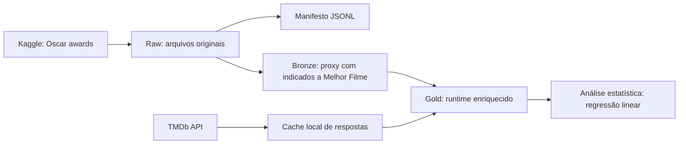

# Cinematic Chronos

Projeto de ciência de dados para responder, com evidência estatística, se os filmes estão ficando mais longos ao longo do tempo. Como não analisamos todos os filmes lançados no mundo, usamos os indicados ao Oscar de Melhor Filme como uma proxy histórica, pública e rastreável para investigar essa tendência.

O projeto foi construído como um pipeline reprodutível de dados, usando arquitetura em camadas `raw`, `bronze`, `silver` e `gold`, separação clara de responsabilidades e componentes pequenos, testáveis e extensíveis. A proposta é demonstrar tanto a investigação estatística quanto decisões de engenharia esperadas em um portfólio sênior.

## Pergunta Analítica

A afirmação investigada é:

> Os filmes vêm aumentando de duração total ao longo do tempo.

Como seria impraticável coletar e validar todos os filmes produzidos globalmente em quase um século de cinema, o projeto usa os indicados ao Oscar de Melhor Filme como proxy. Esse recorte não representa o universo completo de filmes, mas oferece uma série histórica longa, reconhecida publicamente, auditável e com critérios de seleção documentados dentro da indústria cinematográfica.

Assim, a pergunta operacional do projeto é: dentro dessa proxy, existe evidência estatística de aumento da duração dos filmes ao longo do tempo? A resposta será interpretada como um sinal empírico para a hipótese mais ampla sobre filmes em geral, não como prova definitiva sobre toda a produção cinematográfica mundial.

## Hipótese Estatística

A validação será feita por inferência estatística com Regressão Linear Simples:

```text
y = beta_0 + beta_1 x + epsilon
```

Onde:

- `y`: duração do filme indicado ao Oscar de Melhor Filme, em minutos.
- `x`: ano do filme.
- `beta_0`: intercepto estimado.
- `beta_1`: coeficiente angular, interpretado como variação média de minutos por ano.
- `epsilon`: termo de erro.

O teste principal avalia o p-valor associado a `beta_1`.

- Hipótese nula, `H0`: `beta_1 = 0`, ou seja, não há evidência estatística de variação linear da duração ao longo dos anos.
- Hipótese alternativa, `H1`: `beta_1 != 0`, usando o p-valor bilateral padrão reportado por `statsmodels`.

Como a pergunta de negócio é sobre aumento, a conclusão final exige duas condições: `beta_1` positivo e p-valor menor que `alpha`. Assim, a significância indica que há variação linear detectável, e o sinal positivo do coeficiente sustenta a leitura de aumento.

Com nível de significância definido no notebook ou módulo analítico final, a decisão será:

- rejeitar `H0` se o p-valor de `beta_1` for menor que `alpha`;
- não rejeitar `H0` se o p-valor de `beta_1` for maior ou igual a `alpha`.

Importante: significância estatística não implica causalidade nem generalização automática para todos os filmes do mundo. O modelo responde se existe uma tendência linear positiva detectável na proxy analisada. A interpretação para o cinema como um todo deve ser feita como inferência indireta, com as limitações do recorte claramente declaradas.

## Fontes de Dados

O projeto usa duas fontes:

- Kaggle: dataset público `unanimad/the-oscar-award`, usado para obter a lista histórica de indicados ao Oscar de Melhor Filme, que funciona como proxy da análise.
- IMDb/TMDb: fontes consideradas para duração dos filmes. No estado atual do código, o adapter implementado é o TMDb.

A documentação e o código tratam dados brutos como artefatos de execução. O diretório `data/` não deve ser versionado; o pipeline permite reconstruir os datasets locais a partir das fontes configuradas.

## Estado Atual do Pipeline

As etapas implementadas cobrem a ingestão e a preparação da base analítica:

- `raw`: download do Kaggle em `data/raw/kaggle/oscar_awards` e manifesto append-only em `data/raw/manifest.jsonl`.
- `bronze`: filtro dos registros históricos equivalentes a Melhor Filme e escrita em Parquet.
- `gold`: enriquecimento de duração via TMDb, com cache local e controle de chamadas.
- `silver`: camada prevista para padronização analítica intermediária, como normalização de nomes, tipos e chaves de filme/ano antes da modelagem.

Com os dados locais existentes durante esta revisão, os artefatos materializados contêm:

- `bronze`: 621 registros, cobrindo anos de filme de 1927 a 2025.
- `gold`: 621 registros, todos com `runtime_minutes`, `runtime_source` e `tmdb_id` preenchidos.

Esses números são derivados dos Parquets locais e podem mudar quando o dataset Kaggle ou as regras de enriquecimento forem atualizados.

## Arquitetura

```text
cinematic_chronos/
  config/
    ingestion.json
  scripts/
    run_extract.py
    run_process_bronze.py
    run_enrich_tmdb_runtime.py
  src/cinematic_chronos/
    clients/
      tmdb.py
    ingestion/
      kaggle.py
      pipeline.py
    processing/
      bronze.py
      runtime_enrichment.py
    utils/
      columns.py
      env.py
    cli.py
    config.py
    models.py
    storage.py
  tests/
    test_ingestion.py
```

### Fluxo de Dados



## Decisões de Arquitetura

### Camadas Medallion

A separação entre `raw`, `bronze`, `silver` e `gold` evita misturar coleta, limpeza, enriquecimento e modelagem. Isso melhora rastreabilidade e permite reprocessar uma etapa sem repetir todo o pipeline.

- `raw` preserva os arquivos de origem com mínima intervenção.
- `bronze` aplica o primeiro critério de negócio: manter apenas indicados a Melhor Filme, que formam a proxy do estudo.
- `silver` fica reservada para padronização e validações analíticas antes do modelo.
- `gold` entrega a tabela enriquecida com duração, pronta para exploração e inferência.

### Parquet com Compressão ZSTD

As camadas processadas são gravadas em Parquet com compressão ZSTD. A escolha reduz tamanho em disco, preserva schema tabular e melhora leitura seletiva para análises com Pandas, DuckDB ou ferramentas analíticas modernas.

### Manifesto de Ingestão

Cada execução de extract registra metadados em JSON Lines, incluindo origem, destino, status, bytes e timestamp. Esse padrão torna a ingestão auditável sem depender de logs efêmeros.

### Cache de TMDb

O enriquecimento de runtime usa cache local em `data/raw/tmdb/runtime_cache`. Isso evita chamadas repetidas para a API, reduz custo operacional, respeita limites de requisição e torna execuções posteriores mais rápidas.

### Enriquecimento Incremental

A etapa TMDb consulta apenas filmes com `runtime_minutes` ausente. Essa decisão reduz chamadas externas e permite combinar fontes futuras, como IMDb, sem sobrescrever informações já resolvidas.

### Configuração Externa

Diretórios, dataset Kaggle, variáveis de ambiente e parâmetros TMDb ficam em `config/ingestion.json`. O código não precisa mudar para alterar paths, cache, idioma ou nome da variável de segredo.

## SOLID na Implementação

O projeto aplica princípios SOLID de forma pragmática:

- Responsabilidade única: `KaggleDatasetDownloader` baixa datasets, `LocalRawStore` persiste arquivos/metadados, `TmdbRuntimeClient` conversa com TMDb, `process_bronze` transforma Oscar bruto em camada bronze.
- Aberto/fechado: novas fontes podem ser adicionadas como novos adapters de ingestão sem alterar a lógica de armazenamento local.
- Substituição de dependências: o cliente TMDb aceita uma `requests.Session` opcional, permitindo testes com doubles sem chamadas reais.
- Segregação de interfaces: os componentes expostos são pequenos e orientados a uma tarefa específica.
- Inversão de dependência: scripts e CLI orquestram componentes; regras de negócio e clientes externos ficam isolados em módulos reutilizáveis.

## Como Executar

Execute os comandos a partir da raiz do repositório.

### 1. Preparar ambiente

```powershell
.\.venv\Scripts\python.exe -m pip install -e .
```

Para usar Kaggle, configure `KAGGLE_USERNAME` e `KAGGLE_KEY` ou `%USERPROFILE%\.kaggle\kaggle.json`.

Para usar TMDb:

```powershell
Copy-Item cinematic_chronos\.env.example cinematic_chronos\.env
```

Depois preencha `TMDB_API_KEY` em `cinematic_chronos\.env`.

### 2. Baixar dados brutos

```powershell
.\.venv\Scripts\python.exe cinematic_chronos\scripts\run_extract.py
```

Para validar destinos sem chamar fontes externas:

```powershell
.\.venv\Scripts\python.exe cinematic_chronos\scripts\run_extract.py --dry-run
```

Para forçar atualização:

```powershell
.\.venv\Scripts\python.exe cinematic_chronos\scripts\run_extract.py --force
```

### 3. Gerar bronze

```powershell
.\.venv\Scripts\python.exe cinematic_chronos\scripts\run_process_bronze.py
```

Ou via CLI:

```powershell
.\.venv\Scripts\python.exe cinematic_chronos\scripts\run_extract.py process-bronze
```

### 4. Enriquecer duração com TMDb

Validação sem chamadas de API:

```powershell
.\.venv\Scripts\python.exe cinematic_chronos\scripts\run_enrich_tmdb_runtime.py --dry-run
```

Execução efetiva:

```powershell
.\.venv\Scripts\python.exe cinematic_chronos\scripts\run_enrich_tmdb_runtime.py
```

Ou via CLI:

```powershell
.\.venv\Scripts\python.exe cinematic_chronos\scripts\run_extract.py enrich-tmdb-runtime
```

## Qualidade e Testes

Os testes cobrem configuração, armazenamento local, dry-run de Kaggle, filtro de Melhor Filme, escrita Parquet da bronze, enriquecimento TMDb, leitura de segredo via `.env`, cache e fallbacks de busca.

```powershell
.\.venv\Scripts\python.exe -m unittest discover -s cinematic_chronos\tests
```

## Análise Estatística Planejada

A etapa analítica deve consumir `data/gold/oscar_best_picture_nominees_runtime.parquet` e executar:

1. Validação de completude de `year_film` e `runtime_minutes`.
2. Análise exploratória da distribuição de durações por ano ou década.
3. Ajuste de Regressão Linear Simples com `statsmodels`.
4. Avaliação do coeficiente `beta_1`, intervalo de confiança, p-valor e diagnósticos de resíduos.
5. Comunicação da decisão estatística: rejeitar ou não rejeitar `H0`.

Exemplo conceitual:

```python
import pandas as pd
import statsmodels.api as sm

data = pd.read_parquet("cinematic_chronos/data/gold/oscar_best_picture_nominees_runtime.parquet")
model_data = data[["year_film", "runtime_minutes"]].dropna()

X = sm.add_constant(model_data["year_film"])
y = model_data["runtime_minutes"]

model = sm.OLS(y, X).fit()
print(model.summary())
```

O resultado central para a pergunta operacional será o sinal e o p-valor de `year_film`. A conclusão deve separar claramente o achado na proxy dos indicados ao Oscar e a interpretação mais ampla sobre filmes em geral.

## Limitações

- O recorte de indicados ao Oscar é uma proxy e não representa todos os filmes lançados no mundo.
- Mudanças históricas nas regras da categoria Melhor Filme podem afetar a composição da amostra.
- O enriquecimento TMDb depende de correspondência por título e ano; o cache e os fallbacks reduzem, mas não eliminam, risco de match incorreto.
- A regressão linear simples testa tendência linear média, mas pode não capturar quebras estruturais, mudanças por década ou efeitos de outliers.

## Próximos Passos

- Implementar a camada `silver` com schema analítico canônico.
- Criar notebook ou módulo `analysis` com regressão, gráficos e diagnósticos.
- Adicionar validações automatizadas de qualidade de dados.
- Publicar resultados finais com tabela de coeficientes, visualizações e conclusão estatística.
